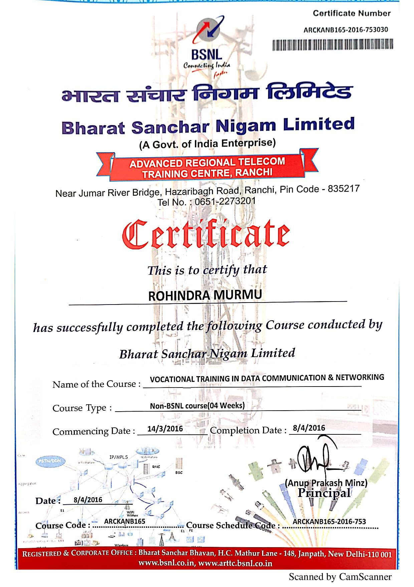

# Summer Training Certificate
- Duration
One month
- Date
14/3/2016 to 8/4/2016
- Description
OSI mode layers, difference between IP address and MAC address, Classification of IP,TCP and UDP protocol. Network topology-star, ring, bus, mesh and hybrid topology. Networking device like switch and router with table. Communicate with different network using cisco packet tracer. Create straight and cross over cable.
- Screenshot

